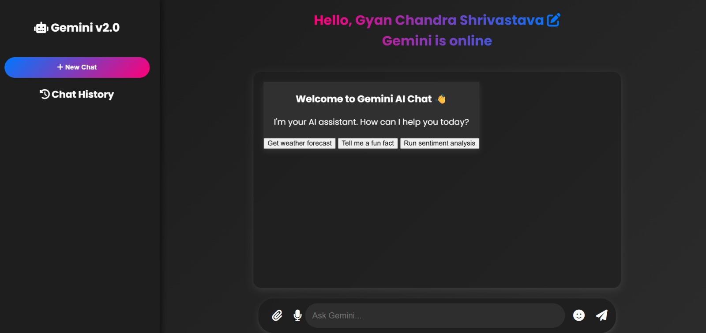
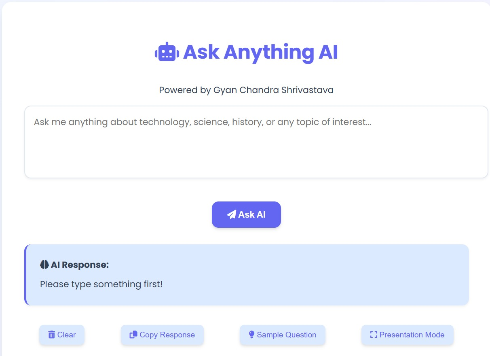
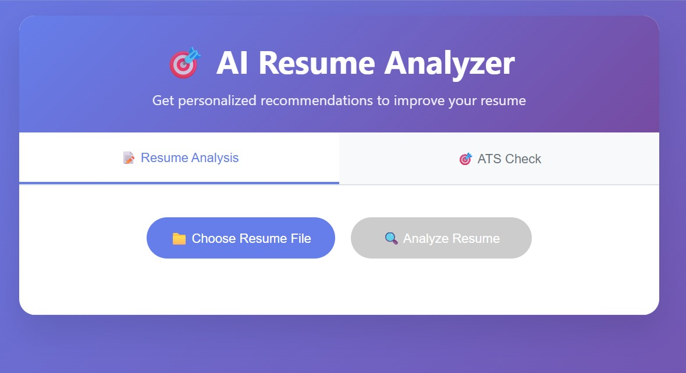
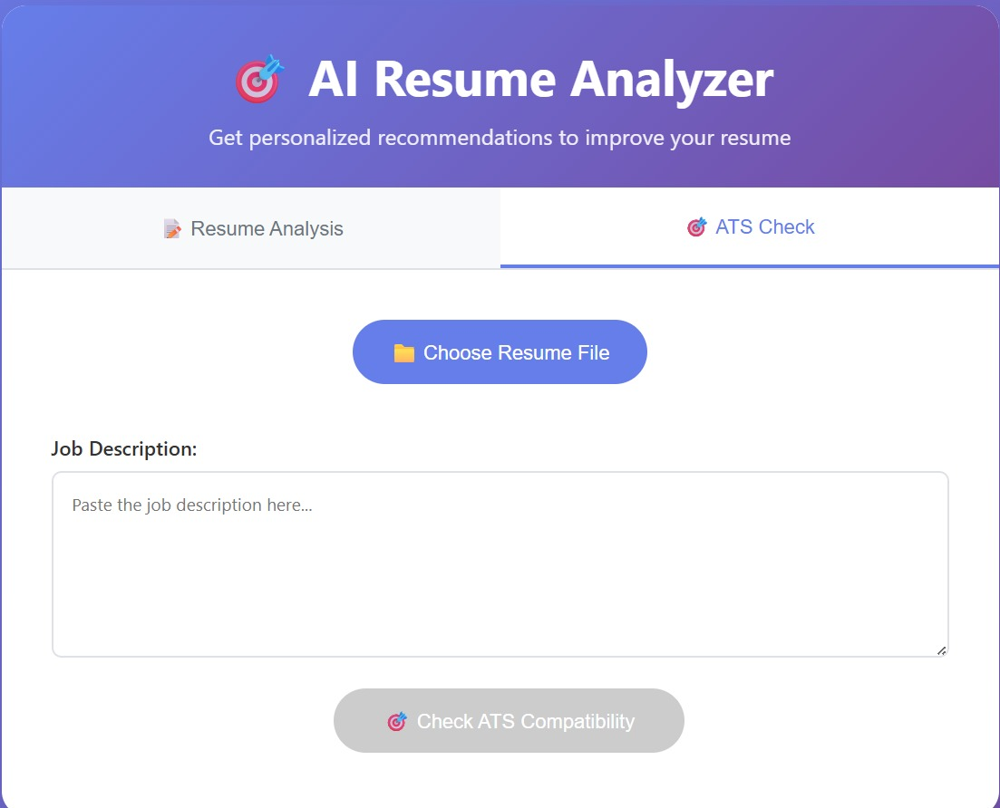

<h1>1. Ask AI Application</h1>
<b>
<or>
<li>Developed an AI-powered Ask Anything application that generates answers to user questions.</li>
<li>Built using Spring Boot with Spring AI to integrate AI model responses.</li>
<li>Implemented REST APIs to send prompts and receive AI-generated responses.</li>
<li>Created a simple HTML, CSS, and JavaScript frontend for user interaction.</li>
<li>Displays AI responses in real time through API calls.</li>
</or>
</b>
 <h2> Tech Stack </h2>
<b>Java | Spring Boot | Spring AI | REST APIs | Maven | HTML | CSS | JavaScript </b> 

## ScreenShots
    

<h1>2. ChatBot Application</h1>
<b>
<or>
<li>Developed an AI ChatBot application that allows users to interact with an AI assistant.</li>
<li>Built the backend using Spring Boot with AI integration for conversational responses.</li>
<li>Implemented REST APIs to handle chat messages and AI responses.</li>
<li>Designed a simple web UI using HTML, CSS, and JavaScript for chatbot interaction.</li>
<li>Provides real-time conversational responses from the AI model.</li>
</or>
</b>
 <h2> Tech Stack </h2>
<b>Java | Spring Boot | Spring AI | REST APIs | Maven | HTML | CSS | JavaScript </b> 

## ScreenShots
     

<h1>3. Resume Analyzer + ATS Score Checker Application</h1>
<b>
<or>
<li>Developed an AI-based Resume Analyzer that evaluates resumes and provides feedback.</li>
<li>Uses Spring Boot and Spring AI to analyze resume content using AI models.</li>
<li>Calculates an ATS (Applicant Tracking System) compatibility score.</li>
<li>Allows users to upload resumes and receive AI-generated analysis and suggestions.</li>
<li>Built a simple frontend interface for resume submission and result display.</li>
</or>
</b>
 <h2> Tech Stack </h2>
<b>Java | Spring Boot | Spring AI | REST APIs | Maven | HTML | CSS | JavaScript </b>  

## ScreenShots
   
   

# That's all 🎊🎉  
